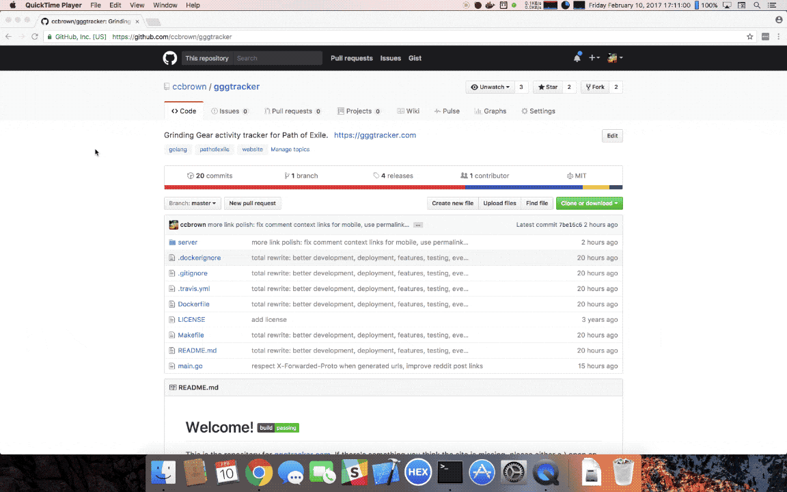

# Welcome! 

This is the repository for [gggtracker.com](https://gggtracker.com). If there's something you think the site is missing, please either a.) open an issue to request the feature or b.) develop the feature yourself and put in a pull request.

### Development

If you have Go installed, you can develop and run the server in the usual way: `go run main.go`

The server will only track Reddit by default. To track the forums, you'll need to use the `--forumsession` argument.

Before creating any pull requests, please run `make pre-commit` to format and test your changes.

### Deployment

The easiest way to deploy is using Docker: `docker run -it -p 8080:8080 ccbrown/gggtracker`

### License / Attribution

This source is released under the MIT license (see the <i>LICENSE</i> file).

Some images used under Creative Commons 3.0 from this project: https://github.com/Templarian/WindowsIcons

This project is not affiliated with Grinding Gear Games.
